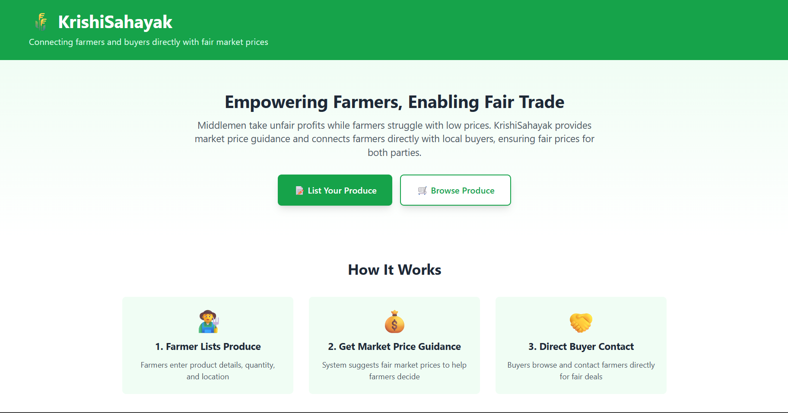

# KrishiSahayak 🌾

KrishiSahayak is a simple digital platform designed to help farmers connect directly with local buyers by providing transparent market price guidance and eliminating unnecessary middlemen.

## 🚜 Problem Statement

Small and rural farmers often struggle to sell their produce at fair prices. They are required to visit multiple shops, negotiate repeatedly, and still end up selling below the actual market price due to lack of information, commissions, and middlemen dominance.

Despite good quality produce, farmers rarely have access to real-time market prices or direct buyers.

## 💡 Solution

KrishiSahayak addresses this gap by:
- Allowing farmers to list their produce easily
- Showing current market price guidance (as reference)
- Enabling buyers to discover nearby farmers
- Providing direct contact between farmers and buyers

The platform focuses on **simplicity, transparency, and fairness**.

## ⚙️ Features (MVP)

- Farmer produce listing
- Market price guidance (reference-based)
- Buyer-side browsing of nearby produce
- Direct contact between buyer and farmer
- No forced pricing, no hidden commissions

## 🛠️ Built With

- HTML
- Tailwind CSS / Bootstrap
- JavaScript
- Node.js (planned backend)

## 🧱 Project Status

This project is currently in the **MVP / prototype stage**.  
The focus is on validating the core idea and user flow before adding advanced features such as authentication, payments, or logistics.

## 📌 Future Scope

- Regional language support
- Expanded market price data
- Buyer and farmer verification
- Simple analytics for price trends
- Mobile-friendly experience

## 👨‍🌾 Inspiration

This project is inspired by real experiences of accompanying family members to local markets and witnessing the challenges farmers face in getting fair prices for their produce.

## 📷 Screenshots

> 

## 📜 License

This project is open for learning and demonstration purposes.
